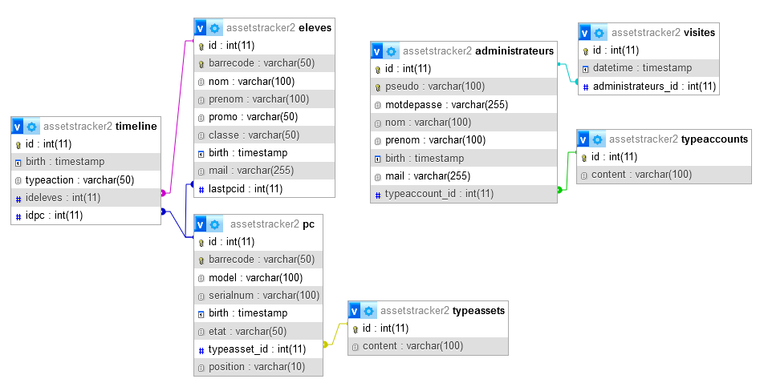

# AssetsTracker

    Gestion d'entrées et de sorties materiel avec codebarres.

VirtualHost config (serveur side conf)

    <VirtualHost *:80>
        DocumentRoot "D:/yourRoot/yourRep/public"
        ServerName assetstracker.pat
        <Directory "D:/yourRoot/yourRep/public">
            Order allow,deny
            Allow from all
            Require all granted
        </Directory>
    </VirtualHost>

Need activation rewrite_module (serveur side conf)

    LoadModule rewrite_module modules/mod_rewrite.so
